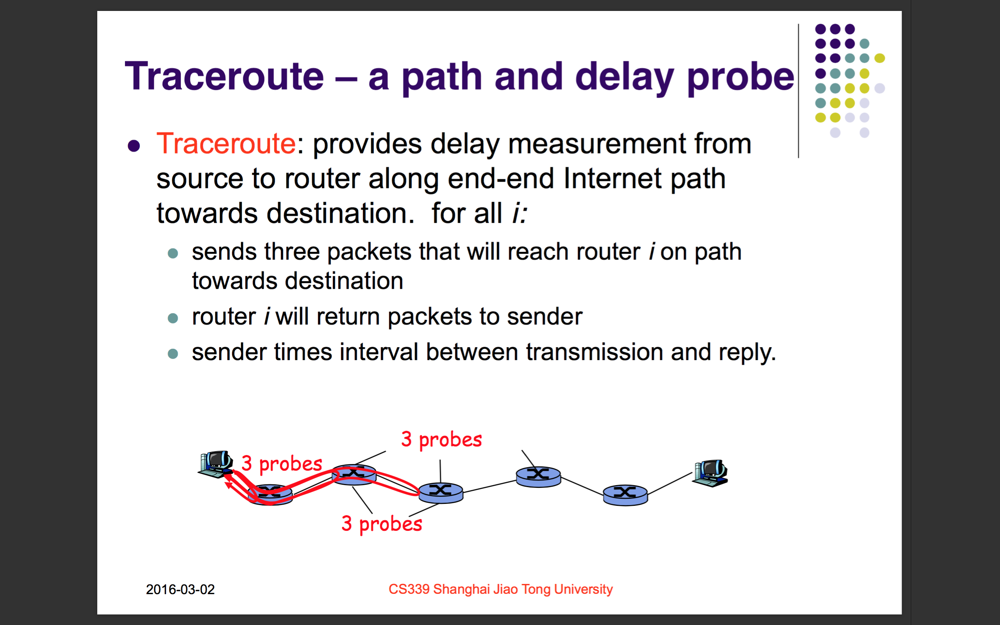
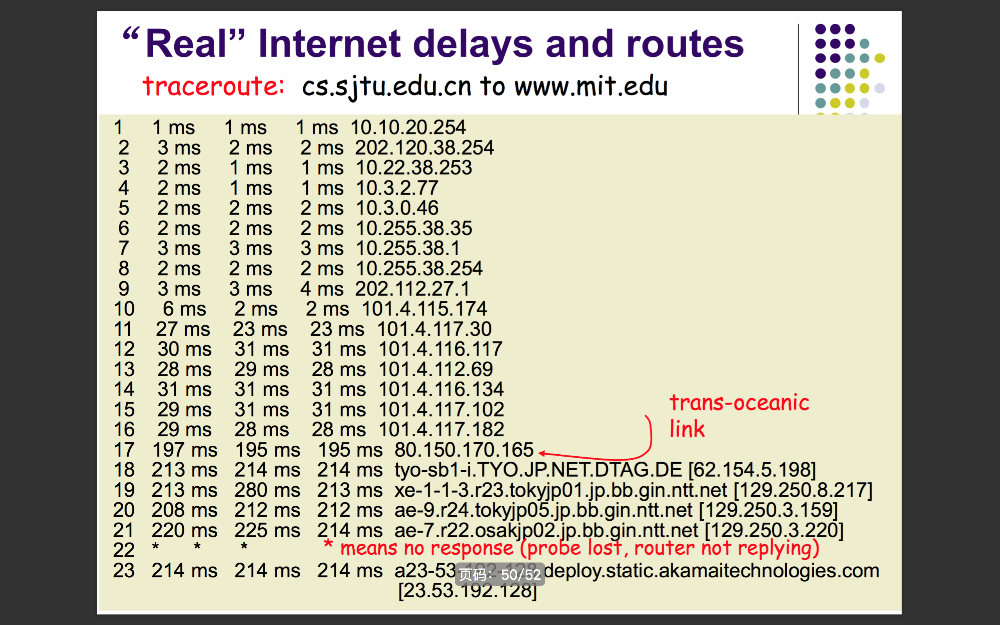
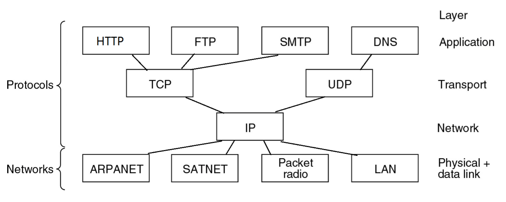
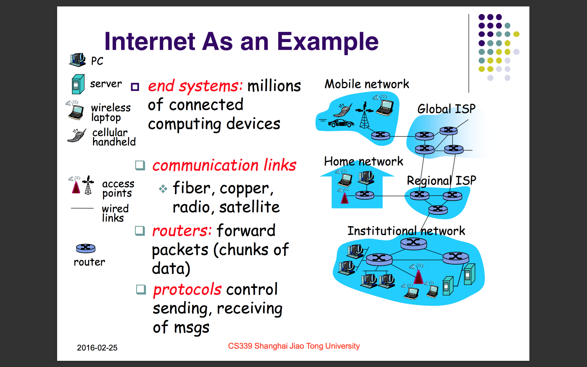

# Note of Network

> a single technology

## Chapter 2. 

## Chapter 1. Introduction

### Topic: network core: packet/circuit switching, Internet structure

### Topic: network edge: hosts, access net, physical media

### Topic: What's the Internet?

### Topic: basic concepts of data transmission

- What happens to a signal as it passes over a wire?
	- The signal is delayed (propagates at 2⁄3c)
	- The signal is attenuated (energy lose)
	- The signal is distorted (high frequency lose)
	- Noise is added to the signal (causes errors)
- Bandwidth 带宽
	- in **EE**: width of frequency band, measured in **Hz**
	- in **CS**: information carrying capacity, in **bits/sec**
- Baud Rate 波特率 and Bit Rate 比特率
	- **Baud Rate**: the number of **samples or symbols** per second sent over the channel
	- **Bit Rate**: the amount of **information in bits** per second sent over the channel
	- **bit rate = baud rate x bits/symbol**
	- The data encoding determines the number of bits/symbol (such as QPSK)
	- **B is for bytes, and b is for bits**
- Throughput 吞吐量
	- rate (bits/sec) at which bits transferred between sender/receiver
	- **instantaneous**: rate at given point in time
	- **average**: rate over longer period of time
- Switching 交换（机制）
	- Circuit switching
	- Packet switching
		- Datagram
		- Virtual Circuit
- Queuing, delay 延迟 and loss 丢包 in packet-switched network
	- packets queue in router buffers when packet arrival rate exceeds output link capacity
	- queue (buffer) has finite capacity
	- packet arriving to full queue dropped (lost)
	- lost packet may be retransmitted by previous node, by source end system, or not at all
	- Four sources of packet delay
		1. processing
		2. queuing
		3. transmission
		4. propagation
	- eg: Router Nodal Delay
		1. $d_{proc}$: typically a few microsecs or less
		2. $d_{queue}$: depends on congestion
		3. $d_{trans}$: L/R, significant for low-speed links
		4. $d_{prop}$: a few microsecs to hundreds of msecs
- Traceroute 路由跟踪 – a path and delay probe

- Performance Definitions
	- Throughput – Number of bits/time you can sustain at the receiver
		- Improves with technology
	- Latency – How long for message to cross network
		- Propagation + Transmit + Queue
		- We are stuck with speed of light...10s of
milliseconds to cross country
	- Goodput – application level throughput, the number of useful information bits/time, FileSize/Latency
	- Jitter – Variation in latency
	- **What matters most for your application?**
		- **We’ll look at network applications next lecture**

### Topic: protocol layers, service models

- Key Interfaces
	- **Horizontally**, the interface between the apps and network is the **Socket APIs**.
	- **Vertically**, the interface between the host and network is the **Network Interface Card**.
- Services: Connections or Not
	- Connection-oriented, the telephone model.
		- **establish** the connection
		- do a lot communication
		- **release** the connection
	- Connectionless, the postal model.
		- your data is put into some kind of envelope on which the destination address has been written.
		- The envelope +contents is sent to the destination.
- Services: Reliable or Not

*Examples* | Connection | Datagram
--- | --- | ---
**Reliable** | TCP (www, email) | Registered mail
**Unreliable** | Voice over IP | IP, UDP (DNS)

- The ISO OSI 7-layer Reference Model

Name | Translate | Exchange Unit | Comment
--- | --- | --- | ---
Application | 应用层 | APDU | protocols and applications needed by users
Presentation | 表示层 | PPDU | data exchanged in a platform-independent way
Session | 会话层 | SPDU | session set up and management
Transport | 传输层 | TPDU | provide end-to-end reliable transfer
Network | 网络层 | Packet | routing and interconnect heterogeneous networks
Data Link | 数据链路层 | Frame | data transfer between neighbor nodes , Media Access Control
Physical | 物理层 | Bit | raw bits "on the wire"

- The TCP/IP 4-layer Reference Model

Name | Translate | Mapping at OSI 7-layer | Comment
--- | --- | --- | ---
Application | 应用层 | Application, Presentation | HTTP
Transport | 传输层 | Session, Transport | TCP
Network | 网络层 | Network | IP
Link | 连接层 | Link, Physical | 802.11 / Ethernet

- "Hourglass" philosophy of Internet

- How to understand this sentence "TCP/IP Model is practically nonexistent" ?
	> DYZ's opinion:
	>
	> OSI is a piece of shit made by the professors in college. OSI has three no-use layers which do not appear in TCP/IP model. There is no professor think up TCP/IP so "TCP/IP Model is practically nonexistent" is written on the PPT.

- The Hybrid Model Used in this Course

Name | Translate | Unit Name | Key Works | Comment
--- | --- | --- | --- | ---
Application | 应用层 | Message | HTTP, FTP, SMTP | programs using network services
Transport | 传输层 | Segment | TCP, UDP | end-end reliable data transfer
Network | 网络层 | Datagram / Packet | IP | send packets over multiple networks
Link | 连接层 | Frame | Ethernet, WiFi, PPP, MAC | data transfer between neighboring network nodes
Physical | 物理层 | Bit | Twisted Pair, Fiber Optics, Wireless | send bits as signals "on the wire"

- Protocol Walkthrough
	- terminal (source / destination): Application, Transport, Network, Link, Physical
	- switch: Link, Physical
	- router: Network, Link, Physical

- Seeing protocols in action with **WireShark** – a packet sniffer
	- go to [download](http://www.wireshark.org/download.html) and try it

### Topic: What's Computer Network?

- Classification
	- Broadcast network 广播网络
	- Point-to-point network 点对点网络
- Internetwork 互联网络 / 网际
	- homogeneous 同种类的
	- interconnecting 互联
	- heterogeneous 各种各样的
	- LAN 局域网 $\rightarrow$ WAN 广域网 $\rightarrow$ Internet 因特网 / 互联网
- Component
	- Hardware
		- Network Interface Cards 网络接口卡 / Network Adapter 网络适配器 (Network Interface Adapter 网络接口适配器)
		- Repeaters 中继器
		- (Network )Bridges 网桥
		- Switches 交换机
		- Routers 路由器
		- Firewalls 防火墙
	- Software
		- Protocols 协议
		- Services 服务
		- Interfaces 接口
- Internet As an Example
	- Communication links
		- fiber 光纤
		- copper 铜
		- radio 无线电
		- satellite 卫星
	- Routers
		- forward packets 传输数据包

