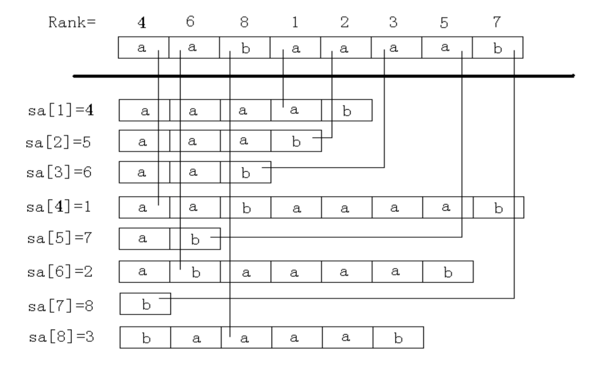

# OI省选算法浅谈

个人水平所限，只能谈及几年前的OI省选水平的算法。再高深的，便不清楚了。

---

**主要参考文献：**

1. **hzwer，[《OI省选算法汇总》](http://hzwer.com/1234.html)。**
2. **_Rayx，[《多种字符串匹配算法杂谈》](http://blog.chinaunix.net/uid-26818262-id-3240133.html)。**
3. **airfer，[《字符串匹配算法比较》](http://blog.csdn.net/airfer/article/details/8951802/)。**
4. **罗穗骞，[《后缀数组——处理字符串的有力工具》](算法合集之《后缀数组——处理字符串的有力工具》.pdf)。**
5. **xiazdong，[《Dijkstra、Bellman_Ford、SPFA、Floyd算法复杂度比较》](http://blog.csdn.net/xiazdong/article/details/8193680#reply)。**
6. **Create Chen，[《理解A*寻路算法具体过程》](http://www.cnblogs.com/technology/archive/2011/05/26/2058842.html)。**
7. **lufy，[《A*寻路算法与它的速度》](http://blog.csdn.net/lufy_legend/article/details/5733733)。**
8. **Amit，蔡鸿译，[《Amit's A star Page中译文》](http://blog.csdn.net/b2b160/article/details/4057781)。**

---

待补充：

1. 每个算法，写出其根本思想，如：
	- 枚举（尝试、搜索、遍历）
	- 贪心（往往配合排序、使用构造思路）
	- 动态规划（记忆化搜索、带剪枝的搜索……）
	- 启发式算法（估值函数）

---

OI算法，大抵可分为以下几类：

1. 数据结构
2. 字符串相关
3. 图论相关
4. 数学相关
5. 动态规划
6. 计算几何
7. 不保证正确性的算法
8. 其他重要工具与方法

下面依次谈一谈。

> 这个算法是怎么来的，是为了解决什么问题而来，以前的算法为什么没有解决，而现在的算法却能解决；现在这个算法还有些什么缺点；能做一些什么问题，不能做些什么问题。—— Ronghua Li

## 数据结构

对数据结构的理解，往往随着接触愈发深入。大致会是这样的历程——

1. 知道的不多，关注如何实现，实现能力较差
2. 会超过十个，关注如何选取，实现愈发纯熟
3. 能联系起来，关注如何组合，实现基本无误
4. 后面的我也不知道了……

首先必须扫盲一下，按我这种分法，OI的完整数据结构历程怎么也得十步以上。随便一个省队队员，基本都已经超越了我说的这三个阶段。然而，实际工程中，普通工程师们对数据结构的理解却很浅，平衡树都不一定写过，可并堆甚至都没听说过。可这并不说明实际工程不需要对数据结构的理解，只能说明不急需，因此普遍水平低。也正因此，我才能在这里写点东西，糊弄一下不搞OI的人。

我大概到了第三阶段的初期，实现基本无误，开始关注如何组合了。虽然实际工程中依旧会偶尔遇到自己并不了解的数据结构。但这往往并不会阻碍我，毕竟工程中的数据结构并不像OI那么高深，借助自己对数据结构的理解，往往可以很快理解并实现一个从未见过的数据结构。

下面，我将一一介绍我所熟悉的数据结构，供大家参考。

### 数组、链表

其实，这俩根本不应该算是数据结构，应该算是实现。区分数组与链表，应该算是数据结构的实现入门吧～

- 数组长度固定，链表则更灵活。
- 数组定位访问速度快，链表拼接切分速度快。

### 堆、并查集、Hash表

- 堆：插入、修改、删除、取最值，时间 $O(logN)$ 。
- 并查集：合并两个集合、查询两个元素是否在同一集合之中，时间 $O(1)$ 。
- Hash表：插入、修改、删除、查询，时间 $O(1)$ 。

### 树状数组、线段树、平衡树、块状数组

- 树状数组：单点修改、区间查询，时间 $O(logN)$ 。
- 线段树：区间修改、查询，时间 $O(logN)$ 。
- 平衡树：插入、修改、删除、查询、取第k大值，时间 $O(logN)$ 。
	- AVL、红黑树：经典，很少用。
	- Treap：实现快、速度快，好用。
	- Splay：还可区间修改、区间查询、区间翻转等等，时间 $O(logN)$ ，虽然常数大点，但非常灵活，再配上CLJ的实现，简直舒服。
- 块状数组、块状链表：插入、修改、删除、查询、取第k大值，时间 $O(\sqrt{N})$ 。

### 可并堆、树套树

- 可并堆：可以合并的堆，依旧保证 $O(logN)$ 的时间。
	- 左偏树：可并堆中的AVL。
	- Random Heap：可并堆中的Treap，这是[作者的介绍](http://fanhq666.blog.163.com/blog/static/819434262010630115338448/)。
	- 斜堆：可并堆中的Splay。
	- 斐波那契堆：这东西……实现太复杂，换来的也就是理论复杂度低一些，实在没必要-_-#
- 树套树：一棵树的每个结点都是另一种树，以此来结合两种树的优点，同时保证时空复杂度。我比较弱，这个很少写，都忘得差不多了，就不妄言了。

### 非OI数据结构

- [从B树、B+树、B*树谈到R树](http://blog.csdn.net/v_july_v/article/details/6530142#t0)

### 其他

数据结构还有很多很多种，以后或许还会再多写一点～这里先随便列点吧^_^

- KD树、四分树
- 可持久化数据结构
	- 可持久化线段树（主席树）
	- 可持久化平衡树
	- 可持久化块状数组

## 字符串相关

### 单模式串匹配

- KMP：在主串S（长度N）中匹配一个模式串P（长度M），预处理时间 $O(M)$ ，匹配时间 $O(N+M)$ 。

- KMP及相关算法时间复杂度比较：

		其中，M为模式串长度，N为主串长度。
		实测时，string长度10000，每个函数都被调用了1000次。

| 算法 | 预处理时间 | 匹配时间 | 实测时间 |
| --- | --- | --- | --- |
| BF | $O(0)$ | $O(NM)$ | 0.078 |
| KMP | $O(M)$ | $O(N)$ | 0.094 |
| BM | $O(N+M^2)$ | $O(N)$ | 0.047 |
| Sunday | $O(M)$ | $O(NM)$ | 0.172 |
| Robin-Karp | $O(0)$ | $O(NM)$ | 0.328 |
| Bitap | $O(M)$ | $O(NM) \rightarrow O(N)$ | 0.281 |

### 字典树（Trie）

> Trie是一种n叉树，n为字母表大小，每个节点表示从根节点到此节点所经过的所有字符组成的字符串。

### 多模式串匹配

- AC自动机：在主串S（长度N）中匹配多个模式串P（长度M），预处理时间 $O(N+\sum M_i)$ ，匹配时间 $O(N+\sum M_i)$ 。

AC自动机就是KMP思想。但用KMP做多模式串匹配的时间复杂度是 $O(\sum{N+M_i})$ 。显然，提高的复杂度是 $O(N(K-1))$ ，其中K表示模式串的个数。而当模式串数量大、模式串较短、主串较长时，算法几乎是从 $O(N^2)$ 降到了 $O(N)$ 。

> 还有一种多模式的匹配算法叫做AC自动机。它能一次匹配多个模式串。它与KMP的思路很像，不匹配时找一个最长的再继续进行！它需要先把字符串建成一颗Trie树，树结点有一个叫做failed的指针，是表示如果不匹配时应该再从哪个结点进行匹配。因为这种做法是一种DFA上的匹配，而发明这种算法的人叫A.C.，所以就叫AC自动机了。复杂度很好，比每个模式串用一次KMP算法要好很多。

### 后缀树、后缀数组

- 这俩是非常有用的字符串处理工具，尤其是后缀数组，很多复杂字符串问题都可以用它来快速完美解决。
- 构造：倍增算法 $O(logN)$ ，DC3算法 $O(N)$ ，但前者常数小一些，且实现较容易。
- 内容：

	- 后缀数组，SA[1~N]，表示“排第几的是谁？”。也就是将S的N个后缀升序排序，把排好序的后缀的开头位置顺次放入SA中。显然，其满足：$$Suffix(SA[i])<Suffix(SA[i+1])$$
	- 名次数组，Rank[1~N]，表示“你排第几？”。也就是 Suffix(i) 在所有后缀中升序排序的名次。
- 用途：
	- 最长公共前缀
	- 单个字符串的相关问题
		- 重复子串
			- 可重叠最长重复子串
			- 不可重叠最长重复子串 (pku1743)
			- 可重叠的最长重复子串 (pku3261)
		- 子串的个数
			- 不相同的子串的个数 (spoj694, spoj705)
		- 回文子串
			- 最长回文子串 (ural1297)
		- 连续重复子串
			- 连续重复子串 (pku2406)
			- 重复次数最多的连续重复子串 (spoj687, pku3693)
	- 两个字符串的相关问题
		- 公共子串
			- 最长公共子串 (pku2774, ural1517)
		- 子串的个数
			- 长度不小于k的公共子串的个数 (pku3415)
	- 多个字符串的相关问题
		- 不小于k个字符串中的最长子串 (pku3294)
		- 每个字符串至少出现两次且不重叠的最长子串 (spoj220)
		- 出现或反转后出现在每个字符串中的最长子串(pku3294)

> 还有一种叫做后缀数组和后缀树的，后缀树是可以转发为后缀数组的，这两种构造起来很不简单，但是复杂度却是惊人的好。如求最长重复连续子串，出现次数最多的子串等都能用它完美的解决。有兴趣的可以搜搜，后缀数组的资料应该是比较多的，而后缀树由于太复杂，资料不是很多，还是有的。

关于后缀数组构造的倍增算法，有一个特别好玩的小故事，大家可以去看看～

[《后缀树,后缀数组,离散化》](http://wenku.baidu.com/link?url=iHFynk6AJPrzRVt8K_s4979uft83AiknejhHOQSQJkShiFEf5G0PFXrrPV4rLYUkVhy5b7iRVA8GcCt3NkF7t57MVJ3TxY-l3TTTzBm16_7)，去看73到81页，可爱的小白兔们^_^

### 模糊匹配

> 上面介绍的都是精确匹配的算法，其实对于字符串，还有一种模糊匹配，有兴趣的读者可以阅读一本叫做《柔性字符串匹配》的书，肯定会让你获益匪浅。

### 其他

- 后缀自动机
- Manacher

## 图论相关

### 搜索相关

- BFS、DFS
- A*
- 迭代加深搜索、双向广搜
	- 迭代加深搜索，建议去看这篇文章：[迭代加深](http://www.xqbase.com/computer/search_iterative.htm)。
- 蚁群算法
- ……

### 最小生成树

- Prim：每次加入最小代价点来构造。时间 $O(NlogN)$ 。
- Kruskal：每次加入最小代价边来构造。时间 $O(MlogM)$ 。

### 最短路、次短路、K短路

- Floyd：**动态规划**，求每对节点之间的最短路径。时间 $O(V^3)$ 。
- Dijkstra：**贪心**，适用于权值为非负的图的单源最短路径。时间 $O((V+E)logV)$ 。
- Bellman-Ford：适用于权值有负值的图的单源最短路径，并且能够检测负圈。时间 $O(VE)$ 。
- SPFA：适用于权值有负值，且没有负圈的图的单源最短路径。能检测负圈，但不能输出负圈。时间 $O(VE)$ ，但一般效率很快，可以认为是 $O(kE)$ ，k为小常数。
- A*寻路：**启发式算法**，给定两点求最短路、K短路，时间取决于估价函数的选取。
	- 估价函数完美时，直接找到正确答案；
	- 估值恒小于实际最短路径时，一定可以找到正确答案，但时间会变长，最差降至BFS。
	- 估值有时大于实际最短路径时，搜索速度会加快，但可能找不到正确答案。

### 图的连通（联通分量、割点、割边）

- Tarjan算法：详见[《三种tarjan算法(上)》](http://blog.csdn.net/nothi/article/details/7739741)。

### 网络流

- 详见[《浅谈网络流的基本算法 [转]》](http://www.cnblogs.com/longdouhzt/archive/2012/05/20/2510743.html)。
	- 最大流
	- 最小割
	- 费用流
	- 分数规划
	- ……

### 树相关

- 树上倍增、公共祖先
	- 详见[《最近公共祖先LCA Tarjan算法》](http://www.cnblogs.com/ylfdrib/archive/2010/11/03/1867901.html)。
- 树链剖分
	- 详见[《树链剖分学习》](http://www.cnblogs.com/kuangbin/archive/2013/08/12/3253734.html)。
- 树的分治算法
	- 详见[《分治算法在树的路径问题中的应用》](分治算法在树的路径问题中的应用.pdf)。
	- 点分治
	- 边分治
	- 树分治
- 动态树
	- 详见[《动态树~LCT总结》](http://blog.csdn.net/d891320478/article/details/9181385)。
	- 再参考[《【动态树初探】link-cut tree》](http://blog.csdn.net/jasonzhu8/article/details/5784117)。
	- LCT
	- 树分块
- 虚树
	- 详见[《bzoj3572_虚树的构建+lca》](http://www.w2bc.com/Article/21720)。
	- 再参考[《BZOJ 3572: [Hnoi2014]世界树 （虚树，DP）》](http://www.kuangbin.net/archives/bzoj3572)。
- Prufer编码
	- 详见[《树的Prufer 编码和最小生成树计数》](http://blog.csdn.net/bingshangjiguang/article/details/6016676)。
	- 再参考[百度百科——prufer数列](http://baike.baidu.com/link?url=LHiyywFefWg8kMQETGENTykYWwdGEI2NEXrIR5U6M62aWGfbD4yDsSNVXDjPczUDoHq8LFWSlBmyn6idOFmMeK)。
	- 再看看[《Prufer 编解码的最优算法》](http://www.doc88.com/p-69011739078.html)。
	- 差不多了，最后一个吧[《经典证明：Prüfer编码与Cayley公式》](http://www.matrix67.com/blog/archives/682)。

### 拓扑排序

- 维护点的入度，不断选择入度为零的点，时间 $O(V+E)$ 。

### 欧拉图

- Fleury算法：求欧拉通路/回路，时间 $O(E^2)$ 。

### 二分图

- 详见[《二分图匹配算法总结》](http://www.360doc.com/content/11/0718/14/3701281_134273282.shtml)。
- 再参考[《二分图最大匹配总结》](http://www.cnblogs.com/kuangbin/archive/2012/08/26/2657446.html)。
- KM算法
- 匈牙利算法

## 数学相关

### （扩展）欧几里得算法、筛法、快速幂

- 斐蜀定理
- 更相减损术

### 欧拉函数与降幂大法
### 费马小定理
### 排列组合

- Lucas定理

### 乘法逆元
### 矩阵乘法
### 数学期望与概率
### 博弈论

- SG函数
- 树上删边游戏

### 拉格朗日乘子法
### 中国剩余定理
### 线性规划与网络流
### 单纯型线性规划
### 辛普森积分
### 模线性方程组
### 容斥原理与莫比乌斯反演
### 置换群
### 快速傅里叶变换
### 大步小步法（BSGS），扩展BSGS

## 动态规划

### 一般、背包、状压、区间、环形、树形、数位动态规划

- 记忆化搜索
- 斯坦纳树
- 背包九讲

### 斜率优化与四边形不等式优化
### 环 + 外向树上的动态规划
### 插头动态规划

## 计算几何

### 计算几何基础
### 三维计算几何初步
### 梯形剖分与三角形剖分
### 旋转卡壳
### 半平面交
### Pick定理
### 扫描线

## 不保证正确性的算法

### 莫队算法，树上莫队
### 模拟退火
### 爬山算法
### 随机增量法

## 其它重要工具与方法

### 模拟与贪心
### 二分，三分法（求偏导）
### 分治，CDQ分治
### 高精度
### 离线
### ST表
